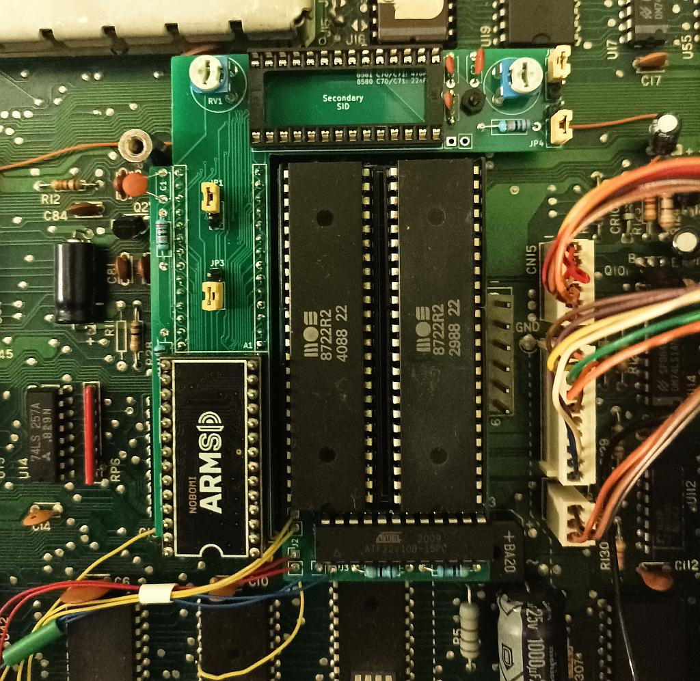
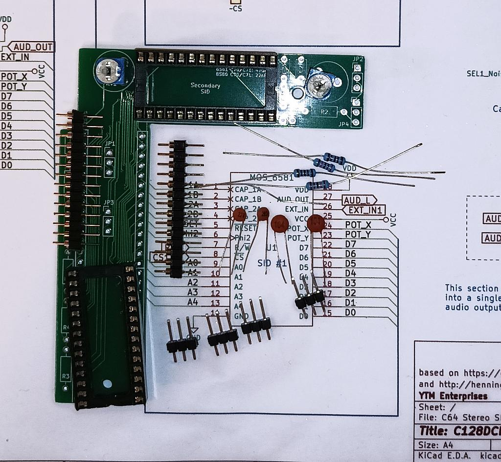

# Dual SID for C128DCR

This is a daughterboard that allows to have dual SID audio in a C128DCR. Although C128DCR has a huge case the space near SID and MMU is very awkward due to power supply.

This project is meant for two 8580 chips, as far as I know the only type installed in C128DCRs. But you never know, so just in case I left information about supporting 6581 SIDs too.

## Background

The goal of this project was to make the PCB fit in the oddly shaped space and make it fit in the narrow area between power suppy and already installed
[256K MMU expansion](https://github.com/ytmytm/c128-mmu-256k-exp).

The audio output is mixed as 6-voices mono and passed through onboard amplifier to audio/video port.

The board supports various modes for external input, including noise reduction and digi boost.

## Design

This is basically a fusion of ideas from two projects:

- [C64 Stereo SID](https://github.com/tebl/C64-Stereo-SID) by tebl (seed project for schematic and PCB)
- [MixSID](http://henning-liebenau.de/mixsid/) by Henning Bekel (noise reduction and digi boost)

I have mostly done measurements and shaped the PCB.

### Schematic

PDF plot of [the schematic can be found here](kicad/plots/C128DCR%20Dual%20SID.pdf).

[kicad](kicad/) folder contains all the KiCad 6.0 project files.

### PCB

[kicad/plots](kicad/plots) folder contains Gerber files for manufacturing a PCB.

The PCB hugs 256K MMU expansion board on one side, tries to avoid power supply on the other side and also has to leave space for screw standoff under the power supply module.

## PCB Assembly

Both SID chips must be identical. For C128DCR these should be usually MOS 8580 powered by 9V.

For 8580:

- be sure that the voltage between pins 14 (GND) and 28 (VDD) of SID socket is 9V
- do not install resistor R8
- use 22nF (symbol 223) capacitors for C71/C72

For 6581:

- be sure that the voltage between pins 14 (GND) and 28 (VDD) of SID socket is 12V
- install resistor R8
- use 470pF (symbol 471) capacitors for C71/C72

## Jumpers

Jumpers JP1/JP3 (SID#1) and JP2/JP4 (SID#2) control external input/noise reduction/digi boost signal routing.

JP1 and JP2 (square pad is pin 1):

- short 1-2 for noise reduction
- short 2-3 to pass external input from audio/video port

JP3 and JP4 (square pad is pin 1):

- short 1-2 to choose signal selected by JP1/JP2: external input or noise reduction
- short 2-3 to enable digi boost instead, this is meant for 8580

You can also keep all jumpers open to make external input floating. Some people claim that it's another way of reducing the noise.

For digi boost additionally set RV1 and RV2 trimmers while playing some sampled audio to bring digital sound to an acceptable volume level relative to regular SID voices.

[MixSID configuration tool](http://henning-liebenau.de/mixsid/configurator.html) has excellent desription of both noise reduction and digi boost modes.

On the image above there is a single ARMSID as primary SID and an unpopulated socket for secondary SID.

For both chips the board is configured with JP3/JP4 for digi boost, so JP1/JP2 set to noise reduction are irrelevant.

Note that R8 is installed here by mistake, but its one leg was cut.

## Installation tips

- solder round pins to two rows of the `SID_ADAPTER` footprint first.
- then solder lowest components first: the resistors (skip R8 if you are going to use 8580 chips)
- then two sockets for primary and secondary SIDs, check the orientation
- finally capacitors and trimmers; pay attention to the correct C70/C71 values

There are small holes in the PCB where plastic standoffs can be put to support the board on both ends and reduce stress on the mainboard SID socket.
It's especially important on the top right end, next to secondary SID.

After assembling two such boards I noticed that power supply modules in different C128DCRs have different dimensions.
To be sure that nothing will be shorted I put kapton tape on the whole left-hand side of the board after installation, also covering socketed primary SID.

## SID#2 chip select signal and testing

You need to decide where in the I/O memory space SID#2 will be available.
Even though signal for $D700 is easily available on C128 (it's pin 12 of U3) most stereo/dual SID tunes use $D420, $D500 or $DE00.

For quick tests SID#2 chip select signal (`/CS2_IN`, the square pad on J4 connector) can come from `I/O1` signal to make SID#2 appear at $DE00 address.
You don't need to reach to expansion port for that, it's already available on pin 9 of U3. Obviously it's not compatible with cartridges but allows for a quick test.

Download this tune: https://csdb.dk/release/?id=96893 and run. Hit '3' to choose $DE00 and you should hear the music - it starts immediately playing on SID#2 channels, SID#1 joins later - after about 30s.

Check out [my other project](https://github.com/ytmytm/c128-u3-replacement) for a better solution to make SID#2 appear at $D420, $D500 (in C64 mode) and optionally at $DE00.
